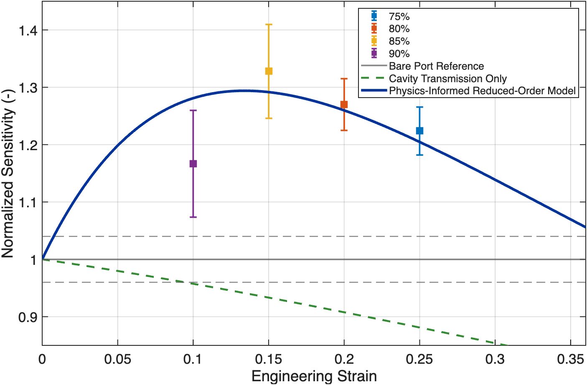

# StrainModel

Reduced-order MATLAB model for strain-dependent pressure transmission in a membrane-confined hydrodynamic sensor interface.

## Overview

This repository contains a reduced-order numerical model used to interpret experimentally observed strain-dependent pressure sensitivity in a hydrodynamic sensor module for Autonomous Underwater Vehicles (AUVs).

The current model represents normalized sensitivity as:

S_norm(eps) = T_cav,norm(eps) * eta_cpl(eps)

where:

- `T_cav,norm(eps)` captures normalized cavity/compressibility transmission  
- `eta_cpl(eps)` captures strain-dependent interface coupling efficiency  

The physical interpretation is:

- `T_cav,norm(eps)` represents the cavity-side response associated with trapped-air compression, cavity volume, and effective interface compliance  
- `eta_cpl(eps)` represents improved pressure transmission at moderate pre-strain, followed by tapering as interface stiffening becomes dominant  

This formulation was adopted to better reflect the observed experimental trend: sensitivity increases at moderate membrane strain, peaks, and then decreases at higher strain.

## Example Output



Example output from the reduced-order model showing normalized sensitivity as a function of engineering strain, compared with experimental calibration data.

## Model Structure

The model consists of two coupled components:

### 1. Cavity Transmission Term

The cavity-side term is evaluated using a trapped-air cavity model based on isothermal ideal gas compression. Each sensing side is treated as a compressible cavity whose effective response depends on:

- nominal cavity volume  
- strain-dependent cavity volume reduction  
- strain-dependent effective interface compliance  

This term is reported as:

T_cav,norm(eps)

which is normalized by its zero-strain value.

### 2. Interface Coupling Term

The interface coupling term is represented as:

eta_cpl(eps)

and is intended to capture the idea that:

- at low pre-strain, pressure transmission is inefficient  
- at moderate pre-strain, coupling improves  
- at high pre-strain, increased stiffness reduces the benefit  

This term provides a physically interpretable way to model the experimentally observed rise-then-taper sensitivity trend.

## Compliance Model Options

The script supports two compliance model options:

### `lumped`

A phenomenological strain-dependent effective compliance model:

- useful for simplified tuning  
- represents membrane stiffness, thickness, geometry, and tensioning in a lumped way  

### `material`

A material-informed compliance surrogate using:

- membrane thickness  
- effective elastic modulus  
- effective membrane span  

This option improves physical traceability while still remaining reduced-order in nature.

## Current Interface and Cavity Assumptions

The current script uses:

- **Interface material:** hygienic latex  
- **Membrane thickness:** 0.020 in  
- **Nominal effective modulus:** 1.2e6 Pa  
- **Working fluid:** trapped air  
- **Cavity model:** isothermal ideal gas compression  
- **Cavity volume:** estimated from a cylindrical + spherical-cap geometry per sensing side  

## Files

- `StrainModel.m`  
  Main MATLAB script implementing the reduced-order model, parameter definitions, cavity-pressure solver, summary printouts, and plotting routines.

## Experimental Reference Points

The script includes experimental summary values for:

- engineering strain  
- normalized sensitivity  
- approximate error bars  

These are used for direct visual comparison between the reduced-order model and calibration-derived sensitivity data.

## Getting Started

Open MATLAB in this repository folder and run:

```matlab
StrainModel
```

The script will:

1. Define experimental strain and sensitivity data  
2. Evaluate the cavity transmission term and coupling efficiency across a continuous strain range  
3. Compute normalized sensitivity using  
   `S_norm = T_cav,norm * eta_cpl`  
4. Print a comparison table between experimental and modeled values  
5. Output RMSE and weighted RMSE  
6. Generate publication-style and diagnostic plots  

## Notes

- The present model is a reduced-order interpretive tool, not a full membrane mechanics solution  
- The cavity-pressure solution assumes an isothermal air-filled cavity (ideal gas)  
- The decomposition  
  `S_norm = T_cav,norm * eta_cpl`  
  separates:
  - cavity/compressibility effects  
  - interface coupling effects  

## Author

Tyler J. Inkley  
Department of Ocean and Resources Engineering  
University of Hawaiʻi at Mānoa  